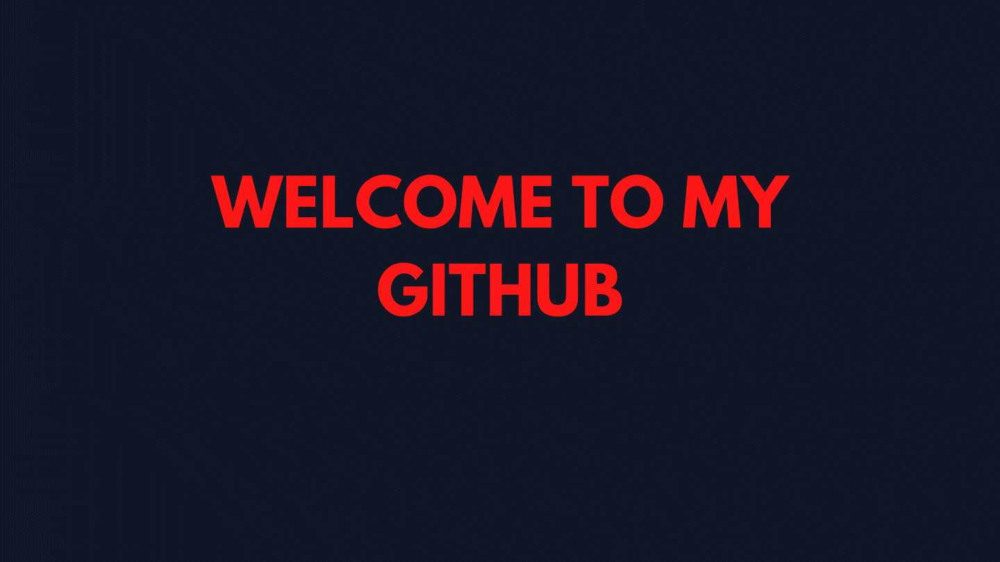

  ## Hi, I'm Vinícius Andrade! 👨‍💻
- 💼 Fullstack Web Developer at [Encora Brazil](https://www.daitan.com/);
- 📖 I'm a Information Systems Undergraduate Student from Brazil at [UNINASSAU](https://www.uninassau.edu.br/);
- 🌱 Learning Web Development (JavaScript, TypeScript, React and GraphQL);
- 🐋 Learning about DevOps with Jenkins, Kubernetes and Docker;
- 🌎 Most of my repositories are written in portuguese, but there are some writen in english as well;
- 📋 Here you can find my college, work and study related projects.

## Something about what I do around here! 📈

  <a href="https://github.com/Kansetsu">
  
  

 
  <h2>My Stacks and Social Media! 🤖</h2>
  
  
    
  
  
       
  
  
          
     
  
  
  
  
  

  
  ##
 

  
  
   

 
  
 
